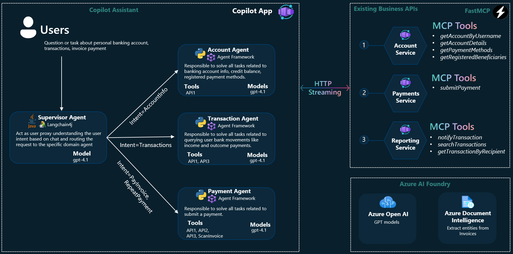
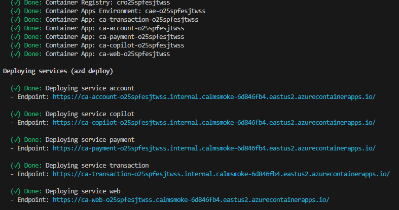

<!-- YAML front-matter schema: https://review.learn.microsoft.com/en-us/help/contribute/samples/process/onboarding?branch=main#supported-metadata-fields-for-readmemd -->
<!-- prettier-ignore -->
<div align="center">


# Multi Agent Banking Assistant with Python and Microsoft Agent Framework


:star: If you like this sample, star it on GitHub — it helps a lot!

[Overview](#overview) • [Architecture](#agents-concepts-and-architectures) • [Get started](#getting-started) •  [Resources](#resources) • [FAQ](#faq) • [Troubleshooting](#troubleshooting)


</div>


## Overview
The core use case of this Proof of Concept (PoC) revolves around a banking personal assistant designed to revolutionize the way users interact with their bank account information, transaction history, and payment functionalities. Utilizing the power of generative AI within a multi-agent architecture, this assistant aims to provide a seamless, conversational interface through which users can effortlessly access and manage their financial data.

Instead of navigating through traditional web interfaces and menus, users can simply converse with the AI-powered assistant to inquire about their account balances, review recent transactions, or initiate payments. This approach not only enhances user experience by making financial management more intuitive and accessible but also leverages the existing workload data and APIs to ensure a reliable and secure service.

Invoices samples are included in the data folder to make it easy to explore payments feature. The payment agent equipped with OCR tools ( Azure Document Intelligence) will lead the conversation with the user to extract the invoice data and initiate the payment process. Other account fake data as transactions, payment methods and account balance are also available to be queried by the user. All data and services are exposed as external REST APIs and **MCP tools** consumed by the agents to provide the user with the requested information.

<div align="center" >
<p> <strong>This sample is powered by:</strong></p>


</div>

<br />

For Semantic Kernel version check this [branch](https://github.com/Azure-Samples/agent-openai-python-banking-assistant/tree/semantic-kernel)


## Features 
This project provides the following features and technical patterns:
 - Multi-agent supervisor architecture using **gpt-4.1** on [Azure AI Foundry](https://azure.microsoft.com/en-us/products/ai-foundry)
 - Exposing your business API as MCP tools for your agents using [fastmcp](https://gofastmcp.com/getting-started/welcome)
 - Agents tools configuration and hand-off agents orchestration using [Agent Framework](https://learn.microsoft.com/en-us/agent-framework/overview/agent-framework-overview).
 - Chat based conversation implemented as [React Single Page Application](https://react.fluentui.dev/?path=/docs/concepts-introduction--docs) with support for images upload.Supported images are invoices, receipts, bills jpeg/png files you want your virtual banking assistant to pay on your behalf.
 - Rich agents human-in-the-loop (HITL) experience supporting agents progress notification and tool approval using [Open AI chatkit protocol](https://platform.openai.com/docs/guides/chatkit).
 - Images scanning and data extraction with Azure Document Intelligence using [prebuilt-invoice](https://learn.microsoft.com/en-us/azure/ai-services/document-intelligence/concept-invoice?view=doc-intel-4.0.0) model.
 - Add an agentic app side-by-side to your existing business microservices hosted on [Azure Container Apps](https://azure.microsoft.com/en-us/products/container-apps).
 - Automated Azure resources creation and solution deployment leveraging [Azure Developer CLI](https://learn.microsoft.com/en-us/azure/developer/azure-developer-cli/).


### Architecture

The home banking assistant is designed as conversational multi-agent system with each agent specializing in a specific functional domain (e.g., account management, transaction history, payments). The architecture consists of the following key components:

- **Agents App (Microservice)**: Serves as the central hub for processing user chat requests. It's a [FastAPI](https://fastapi.tiangolo.com/) app which uses  **agent-framework** to create Agents equipped with tools and orchestrate them using [hand-off pattern](https://learn.microsoft.com/en-us/azure/architecture/ai-ml/guide/ai-agent-design-patterns#handoff-orchestration).
    - **Supervisor Agent**: It's responsible to triage the user request, and delegate the task to the specialized domain agent. This component ensures that user queries are efficiently handled by the relevant agent. Agents are engaged by the supervisor in a single turn conversation meaning that only one is selected by the supervisor to answer to user task. 
    
    - **Account Agent**: Specializes in handling tasks related to banking account information, credit balance, and registered payment methods. It leverages specific Account service APIs to fetch and manage account-related data. The Microsoft Agent Framework is used to create account specific tools definition from the MCP server and automatically call the HTTP endpoint with input parameters extracted by gpt4 model from the chat conversation.

    - **Transactions Agent**: Focuses on tasks related to querying user bank movements, including income and outcome payments. This agent accesses account mcp server to retrieve accountid and transaction history mcp server to search for transactions and present them to the user.

    - **Payments Agent**: Focuses on managing tasks related to submitting payments. It interacts with multiple MCP servers and tools, such as ScanInvoice (backed by Azure Document Intelligence), Account Service to retrieve account and payment methods info, Payment Service to submit payment processing and Transaction History service to check for previous paid invoices.

- **Existing Business APIs**: Interfaces with the backend systems to perform operations related to personal banking accounts, transactions, and invoice payments. These APIs are implemented as external spring boot microservices providing the necessary data and functionality consumed by agents to execute their tasks. They are exposed as MCP endpoints using [FastMCP](https://gofastmcp.com/getting-started/welcome) to be consumed by agents.
    - **Account MCP Service (Microservice)**: Provides functionalities like retrieving account details by username, fetching payment methods, and getting registered beneficiaries. This microservice supports all 3 agents.

    - **Payments MCP Service (Microservice)**: Offers capabilities to submit payments and notify transactions. It is a critical component for the Payments Agent to execute payment-related tasks efficiently.

    - **Reporting MCP Service (Microservice)**: Enables searching transactions and retrieving transactions by recipient. This service supports the Transactions Agent in providing detailed transaction reports to the user and the Payment Agent as it needs to check if an invoice has not been already paid.

- **Multi agent orchestration**: The supervisor pattern to orchestrate and delegate tasks to different domain specific agents is implemented using different approaches available for you to explore
  - **Hand-off pattern + Chatkit**: This pattern is implemented using the [hand-off orchestration](https://learn.microsoft.com/en-us/azure/architecture/ai-ml/guide/ai-agent-design-patterns#handoff-orchestration) available as pre-built orchestration in the Microsoft Agent Framework. Look here for code details [handoff_orchestrator_chatkit.py](app/backend/app/agents/azure_chat/handoff/chatkit/handoff_orchestrator_chatkit.py). Furthermore the chat ui and  agents interaction is implemented using [OpenAI chatkit protocol](https://platform.openai.com/docs/guides/chatkit) for better human in the loop experience supporting agents progress notification and tool approval widget streaming.
  - **Hand-off pattern + custom UI-Agent protocol**: As the above but without using the chatkit protocol specification. This has limited support for HITL patterns and use a simple chat interface that's not integrated into an existing home banking app.Look here for code details [handoff_orchestrator_custom_protocol.py](app/backend/app/agents/azure_chat/handoff/handoff_orchestrator.py)
  - **Domain agents as tools**: In this approach the domain specific agents are exposed as tools to the supervisor agent which can call them as tools when needed.That is based on Agent Framework Agent abstractions only. Look here for code details [supervisor_agent.py](app/backend/app/agents/azure_chat/agents_as_tools/supervisor_agent.py)
  
## Getting Started


### Prerequisites

* [Python >= 3.11](https://www.python.org/downloads/release/python-31113/)
* [uv](https://github.com/astral-sh/uv)
* [Azure Developer CLI](https://aka.ms/azure-dev/install)
* [Node.js](https://nodejs.org/en/download/)
* [Git](https://git-scm.com/downloads)
* [Powershell 7+ (pwsh)](https://github.com/powershell/powershell) - For Windows users only.
  * **Important**: Ensure you can run `pwsh.exe` from a PowerShell command. If this fails, you likely need to upgrade PowerShell.


> [!WARNING]
> Your Azure Account must have `Microsoft.Authorization/roleAssignments/write` permissions, such as [User Access Administrator](https://learn.microsoft.com/azure/role-based-access-control/built-in-roles#user-access-administrator) or [Owner](https://learn.microsoft.com/azure/role-based-access-control/built-in-roles#owner).  

### Starting from scratch

You can clone this repo and change directory to the root of the repo. Or you can run `azd init -t Azure-Samples/agent-openai-python-banking-assistant`.

Once you have the project available locally, run the following commands if you don't have any pre-existing Azure services and want to start from a fresh deployment.

1. Run 

    ```shell
    azd auth login
    ```

2. Run 

    ```shell
    azd up
    ```
    
    * This will provision Azure resources and deploy this sample to those resources.
    * The project has been tested with gpt-4o and gpt-4.1 model which is currently available with several deployment options these regions. The default is global standard. For more info on deployments and updated region availability check [here](https://learn.microsoft.com/en-us/azure/ai-foundry/foundry-models/concepts/models-sold-directly-by-azure?pivots=azure-openai&tabs=global-standard-aoai%2Cstandard-chat-completions%2Cglobal-standard#model-summary-table-and-region-availability)


3. After the application has been successfully deployed you will see a web app URL printed to the console.  Click that URL to interact with the application in your browser.  

It will look like the following:




### Redeploying

If you've only changed the backend/frontend code in the `app` folder, then you don't need to re-provision the Azure resources. You can just run:

```shell
azd deploy
```

If you've changed the infrastructure files (`infra` folder or `azure.yaml`), then you'll need to re-provision the Azure resources. You can do that by running:

```shell
azd up
```
 > [!WARNING]
 > When you run `azd up` multiple times to redeploy infrastructure, make sure to set the following parameters in `infra/main.parameters.json` to `true` to avoid container apps images from being overridden with default "mcr.microsoft.com/azuredocs/containerapps-helloworld" image:

```json
 "copilotAppExists": {
      "value": false
    },
    "webAppExists": {
      "value": false
    },
    "accountAppExists": {
      "value": false
    },
    "paymentAppExists": {
      "value": false
    },
    "transactionAppExists": {
      "value": false
    }
```

### Running Agents locally
Once you have created the Azure resources with `azd up` or `azd provision`, you can run all the apps locally (instead of using Azure Container Apps). For more details on how to run each app check:
-  the [README.md](app/backend/README.md) to run the agents backend and the front-end
-  the [README.md](app/business-api/python/README.md) to run the simulated banking mcp servers.


## Guidance

### Testing different gpt models, versions and sku.
The default LLM used in this project is *gpt-4.1* deployed with global standard on Azure AI Foundry.
You can test different models and versions by changing the model sections in the [infra/main.parameters.json](infra/main.parameters.json). An example:

```shell
"models": {
      "value": [
        {
          "deploymentName": "gpt-4.1",
          "name": "gpt-4.1",
          "format": "OpenAI",
          "version": "2025-04-14",
          "skuName": "GlobalStandard",
          "capacity": 80
        }
      ]
    }
```

### Restrict access to public webapp

By default, the web app on ACA will have no authentication or access restrictions enabled, meaning anyone with routable network access to the web app can chat with your personal assistant.You can require authentication to your Microsoft Entra by following the [Add app authentication](https://learn.microsoft.com/en-us/azure/container-apps/authentication) tutorial and set it up against the deployed web app.


To then limit access to a specific set of users or groups, you can follow the steps from [Restrict your Microsoft Entra app to a set of users](https://learn.microsoft.com/entra/identity-platform/howto-restrict-your-app-to-a-set-of-users) by changing "Assignment Required?" option under the Enterprise Application, and then assigning users/groups access.  Users not granted explicit access will receive the error message -AADSTS50105: Your administrator has configured the application <app_name> to block users 

### Security Considerations

> [!IMPORTANT]
> **This sample is a proof-of-concept and does not implement app authentication or authorization**. 


The sample does not cover the following aspects, essential to the security of the solution:

- **No isolation of user conversations**: After app deployment on Azure, the platform does not isolate conversations or other persisted state by end user.
- **No authentication or authorization of end users**: Access to webapp is granted via role assignment in the subscription ( see [Restrict Acccess to public webapp](#restrict-access-to-public-webapp)). The aspect of end user authentication/authorization must be addressed as a separate app concern;


When deploying to production with real customer data, consider implementing:

- **End-user authentication and authorization integrated with your identity provider**
- **Conversation and data isolation per user and per account**
- **Audit logging of all access and operations**
- **Compliance with applicable regulations (PCI-DSS, GDPR, local banking regulations)**


### UI selection

This project provides two frontend options to choose from, each with different capabilities and backend integration requirements:

#### 1. **banking-web** (Default - Chatkit Protocol)
A fully-featured React Single Page Application built with React shadcn/ui that supports:
- Rich human-in-the-loop (HITL) experience
- Agent progress notifications
- Tool approval widgets
- Image upload support for invoices and receipts
- Chatkit protocol compliance
- Integrated into a banking app interface

**To use this frontend:**
- In `azure.yaml`: Ensure the `banking-web` service is **uncommented** and `simple-chat` is **commented out**
- In `app/backend/Dockerfile`: Use the CMD line:
  ```dockerfile
  CMD ["uvicorn", "app.main_chatkit_server:app", "--host", "0.0.0.0", "--port", "8080"]
  ```

#### 2. **simple-chat** (Custom Protocol)
A lightweight chat interface with basic conversational capabilities:
- Simple chat UI without advanced HITL patterns
- No tool approval widgets or progress notifications
- Image upload support for invoices and receipts

**To use this frontend:**
- In `azure.yaml`: Ensure the `simple-chat` service is **uncommented** and `banking-web` is **commented out**
- In `app/backend/Dockerfile`: Use the CMD line:
  ```dockerfile
  CMD ["uvicorn", "app.main_handoff:app", "--host", "0.0.0.0", "--port", "8080"]
  ```

> [!IMPORTANT]
> When switching between frontends, you must update **both** the `azure.yaml` and `app/backend/Dockerfile` files to maintain compatibility. After making changes, redeploy using `azd deploy` or `azd up`.

### Agent Framework - Chatkit protocol support

This sample implements UI-to-agent communication approach built on top of the [OpenAI ChatKit protocol](https://platform.openai.com/docs/guides/chatkit) and [Microsoft Agent Framework](https://github.com/microsoft/agent-framework), specifically addressing key concerns around chatkit.js production deployment that are outlined in the [Agent Framework ChatKit integration documentation](https://github.com/microsoft/agent-framework/blob/main/python/packages/chatkit/README.md).

**Key Challenges Addressed:**

The ChatKit protocol provides a standardized chat communication pattern for AI agents, but the default implementation has several limitations for air gapped cloud:

1. **Network Dependencies**: The ChatKit frontend requires connectivity to OpenAI's CDN (`cdn.platform.openai.com`) and external services, making it unsuitable for air-gapped or highly-regulated environments
2. **Domain Registration**: Production deployments require manual domain registration at platform.openai.com

**Our Solution:**

This sample extends the Agent Framework's ChatKit integration:

- **Chatkit Protocol Compliant**: supports ChatKit server protocol specification for rich human-in-the-loop (HITL) experiences including:
  - Real-time agent progress notifications during task execution
  - Tool approval widgets for user confirmation before sensitive operations
  - Structured event streaming (thread.created, thread.item.done, etc.)
  - Support for attachments and multi-modal content (invoice images, receipts)

- **Extended Agent Framework**: Enhances the base `agent-framework-chatkit` package with:
  - Custom handoff orchestration patterns optimized for multi-agent banking workflows
  - Persistent checkpoint management for conversation state across sessions
  - Seamless integration between Agent Framework's `HandoffBuilder` and ChatKit's event streaming

- **Custom Reusable Chat Component**: Built a framework-agnostic React chat component (`banking-web/src/components/chat`) that:
  - Supports the ChatKit protocol client-side specification
  - Can be embedded into existing web applications (demonstrated in a banking app context)
  - Provides a clean API for thread management, message and attachment handling, and event callbacks

**Technical Implementation:**

The backend uses `agent-framework-chatkit` to bridge Agent Framework agents with ChatKit's protocol, implementing a custom `ChatKitServer` subclass ([chatkit_server.py](app/backend/app/routers/chatkit/chatkit_server.py)) that handles thread persistence, message conversion, and event streaming. The frontend chat component consumes the ChatKit SSE stream and renders progress indicators, approval widgets, and conversation history in a banking-integrated interface.

This approach demonstrates how to build production-grade agentic applications that combine the power of Agent Framework's orchestration capabilities with the user experience benefits of the ChatKit protocol, while maintaining full control over deployment, security, and customization requirements.

More info on the implementation can be found in the [docs/chat-server-protocol.md](docs/chat-server-protocol.md).

### Cost estimation

Pricing varies per region and usage, so it isn't possible to predict exact costs for your usage.
However, you can try the [Azure pricing calculator](https://azure.com/e/8ffbe5b1919c4c72aed89b022294df76) for the resources below.

- Azure Containers App: Consumption workload profile with 4 CPU core and 8 GB RAM. Pricing per vCPU and Memory. [Pricing](https://azure.microsoft.com/en-us/pricing/details/container-apps/)
- Azure OpenAI: Standard tier, ChatGPT and Ada models. Pricing per 1K tokens used, and at least 1K tokens are used per question. [Pricing](https://azure.microsoft.com/en-us/pricing/details/cognitive-services/openai-service/)
- Azure Document Intelligence: SO (Standard) tier using pre-built layout. [Pricing](https://azure.microsoft.com/pricing/details/form-recognizer/)

- Azure Blob Storage: Standard tier with ZRS (Zone-redundant storage). Pricing per storage and read operations. [Pricing](https://azure.microsoft.com/pricing/details/storage/blobs/)
- Azure Monitor: Pay-as-you-go tier. Costs based on data ingested. [Pricing](https://azure.microsoft.com/pricing/details/monitor/)

The first 180,000 vCPU-seconds, 360,000 GiB-seconds, and 2 million requests each month are free for ACA. To reduce costs, you can switch to free SKUs Document Intelligence by changing the parameters file under the `infra` folder. There are some limits to consider; for example, the free resource only analyzes the first 2 pages of each document. 

⚠️ To avoid unnecessary costs, remember to take down your app if it's no longer in use,
either by deleting the resource group in the Portal or running `azd down`.


## Resources

Here are some resources to learn more about multi-agent architectures and technologies used in this sample:

- [Microsoft Agent Framework](https://github.com/microsoft/agent-framework)
- [AI agents For Beginners](https://github.com/microsoft/ai-agents-for-beginners)
- [Azure AI Foundry](https://learn.microsoft.com/en-us/azure/ai-foundry/what-is-azure-ai-foundry)
- [Develop AI apps using Azure services](https://aka.ms/azai)
- [Building Effective Agents - Anthropic](https://www.anthropic.com/engineering/building-effective-agents)
- [AI agent orchestration patterns](https://learn.microsoft.com/en-us/azure/architecture/ai-ml/guide/ai-agent-design-patterns)


You can also find [more Azure Ai agents samples here](https://aka.ms/aiapps)


## Getting Help

If you get stuck or have any questions about building AI apps, join:

[](https://aka.ms/foundry/discord)

If you have product feedback or errors while building visit:

[](https://aka.ms/foundry/forum)

## Troubleshooting

If you have any issue when running or deploying this sample [open an issue](https://https://github.com/Azure-Samples/agent-openai-python-banking-assistant/issues) in this repository.

## Contributing

This project welcomes contributions and suggestions. Most contributions require you to agree to a
Contributor License Agreement (CLA) declaring that you have the right to, and actually do, grant us
the rights to use your contribution. For details, visit https://cla.opensource.microsoft.com.

When you submit a pull request, a CLA bot will automatically determine whether you need to provide
a CLA and decorate the PR appropriately (e.g., status check, comment). Simply follow the instructions
provided by the bot. You will only need to do this once across all repos using our CLA.

This project has adopted the [Microsoft Open Source Code of Conduct](https://opensource.microsoft.com/codeofconduct/).
For more information see the [Code of Conduct FAQ](https://opensource.microsoft.com/codeofconduct/faq/) or
contact [opencode@microsoft.com](mailto:opencode@microsoft.com) with any additional questions or comments.

## Trademarks

This project may contain trademarks or logos for projects, products, or services. Authorized use of Microsoft
trademarks or logos is subject to and must follow
[Microsoft's Trademark & Brand Guidelines](https://www.microsoft.com/en-us/legal/intellectualproperty/trademarks/usage/general).
Use of Microsoft trademarks or logos in modified versions of this project must not cause confusion or imply Microsoft sponsorship.
Any use of third-party trademarks or logos are subject to those third-party's policies.

[Langchain4j]: https://github.com/langchain4j/langchain4j

