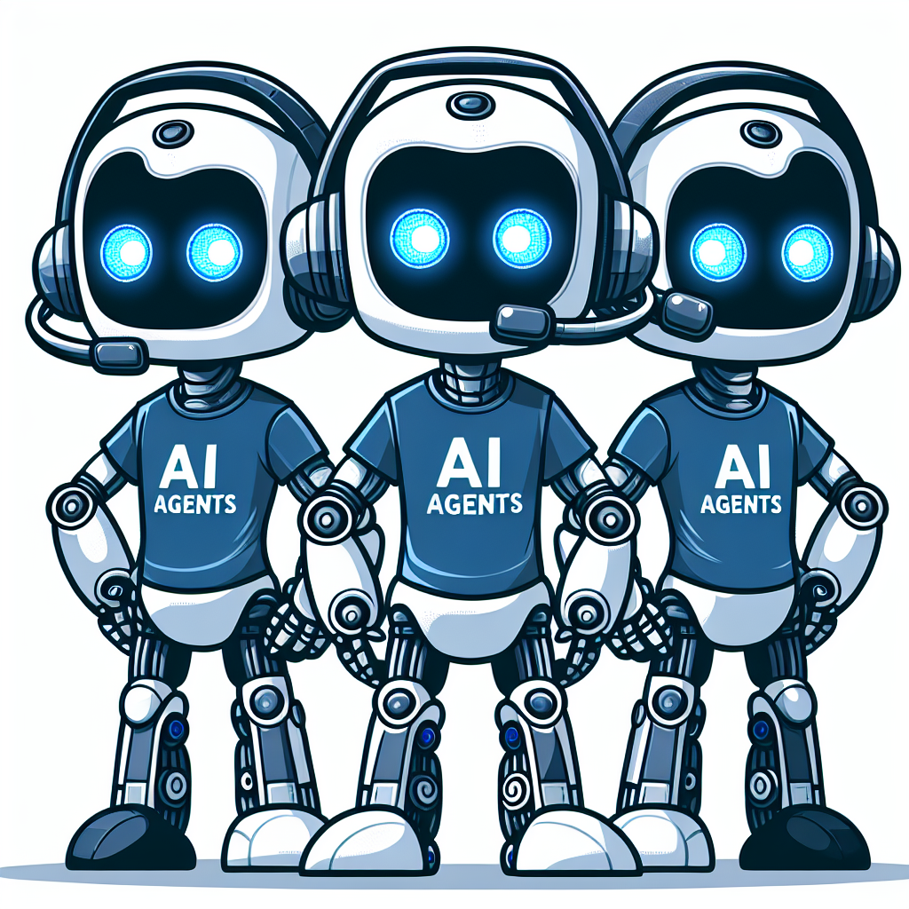
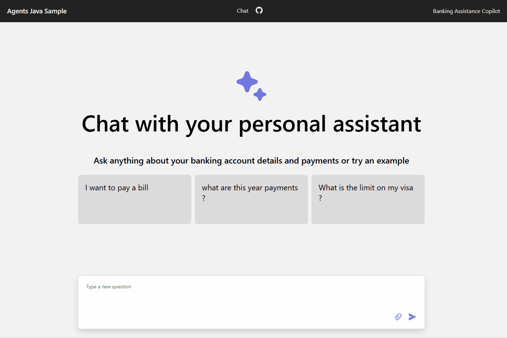
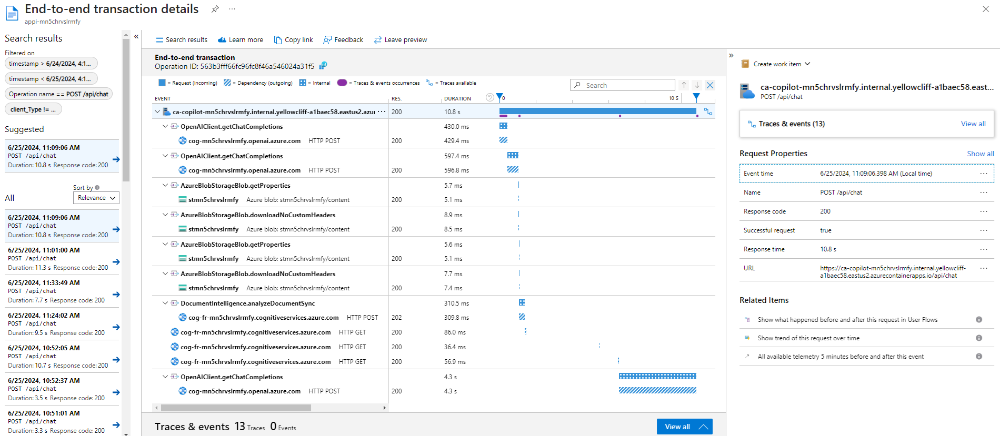

<!-- prettier-ignore -->
<div align="center">



# Multi Agents Banking Assistant with Java and Semantic Kernel

[](https://codespaces.new/dantelmomsft/personal-finance-assistant-java?hide_repo_select=true&ref=main&quickstart=true)
[](https://github.com/dantelmomsft/personal-finance-assistant-java/actions)

[](LICENSE)

<!-- []() -->

:star: If you like this sample, star it on GitHub — it helps a lot!

[Overview](#overview) • [Architecture](#agents-concepts-and-architectures) • [Get started](#getting-started) •  [Resources](#resources) • [FAQ](#faq) • [Troubleshooting](#troubleshooting)


</div>

This project is designed as a Proof of Concept (PoC) to explore the innovative realm of generative AI within the context of multi-agent architectures. By leveraging Java and Microsoft Semantic Kernel AI orchestration framework, our aim is to build a chat web app to demonstrate the feasibility and reliability of using generative AI agents to transform user experience from web clicks to natural language conversations while maximizing reuse of the existing workload data and APIs.


## Overview
The core use case of this Proof of Concept (PoC) revolves around a banking personal assistant designed to revolutionize the way users interact with their bank account information, transaction history, and payment functionalities. Utilizing the power of generative AI within a multi-agent architecture, this assistant aims to provide a seamless, conversational interface through which users can effortlessly access and manage their financial data.

Instead of navigating through traditional web interfaces and menus, users can simply converse with the AI-powered assistant to inquire about their account balances, review recent transactions, or initiate payments. This approach not only enhances user experience by making financial management more intuitive and accessible but also leverages the existing workload data and APIs to ensure a reliable and secure service.

Invoices samples are included in the data folder to make it easy to explore payments feature. The payment agent equipped with OCR tools ( Azure Document Intelligence) will lead the conversation with the user to extract the invoice data and initiate the payment process. Other account fake data as transactions, payment methods and account balance are also available to be queried by the user. All data and services are exposed as external REST APIs and consumed by the agents to provide the user with the requested information.


## Agents Concepts and Architectures


The development of a vertical multi-agent architecture for a personal banking assistant is inspired by a blend of cutting-edge research and practical applications in the field of generative AI and agent-based systems:

1. **Agent and Loop Mechanism**: An Agent is made up of three building blocks: Instructions (a.k.a prompt), Tools and LLM model to use. The core idea of agents is to use a language model like gpt4 to choose a sequence of actions, which can be supported by tools, in order to solve a task based on the instructions provided in the prompt. This can best be thought of as a loop where the agent iteratively processes user input, decides on actions or responses, and updates its internal state (agent scratchpad). This mechanism allows for complex interactions and task execution beyond simple text generation.

2. **Integration of AI Agents with LLMs and RAG**: AI agents enhance copilot application based on Retrieval Augmented Generation (RAG) pattern by enabling real-world task execution, decision-making, and real-time interaction. While in RAG a sequence of actions are well-known and are developed as a predefined LLM chain in app code, with agents a LLM is used as a reasoning engine to determine which actions to take and in which order.This integration is crucial for applications requiring dynamic responses and actions based on user inputs.

3. **Multi-Agent Architectures**: The debate between single and multi-agent systems highlights the versatility of multi-agent architectures in handling complex tasks requiring collaboration and multiple execution paths. Vertical and horizontal architectures represent two approaches, with most systems falling somewhere in between. Specifically, vertical architectures, where one agent acts as a leader coordinating with other specialized agents, are particularly relevant for building a personal banking assistant. This structure allows for a clear division of labor and efficient collaboration among agents with different functional domains.

5. **MicroAgents Concept**: The idea of MicroAgents, as proposed by the semantic kernel team at Microsoft, offers a practical approach to implementing vertical multi-agent systems. By partitioning agents by functional domain and associating each with a microservice, a banking assistant can leverage specialized knowledge and services (e.g., account management, transaction history, payments) to provide a comprehensive and user-friendly experience.


## Personal Banking Vertical Multi-Agent Architecture
<div align="center">

</div>

The personal banking assistant is designed as a vertical multi-agent system, with each agent specializing in a specific functional domain (e.g., account management, transaction history, payments). The architecture consists of the following key components:

- **Copilot Assistant Copilot App (Microservice)**: Serves as the central hub for processing user requests. It's a spring boot application implementing a vertical multi-agent architectures using Java Semantic Kernel to create Agents equipped with tools. in Java the Agent Router to understand user intent from chat interactions and routes the request to the appropriate domain-specific agent.
    - **Agent Router**: Acts as a user proxy, interpreting user intent based on chat inputs and directing the request to the specific domain agent. This component ensures that user queries are efficiently handled by the relevant agent. It uses **IntentExtractor** tool backed by GPT4 model to extract the user intent in a json format. If intent is 'None' clarifying questions are provided. 

    - **Account Agent**: Specializes in handling tasks related to banking account information, credit balance, and registered payment methods. It leverages specific Account service APIs to fetch and manage account-related data. Semantic Kernel HTTP plugin is used to create a tool definition from the rest api yaml contract (Open API specification) and automatically call the HTTP endpoint with input parameters extracted by gpt4 model from the chat conversation.

    - **Transactions Agent**: Focuses on tasks related to querying user bank movements, including income and outcome payments. This agent accesses account api to retrieve accountid and transaction history service to search for transactions and present them to the user.

    - **Payments Agent**: Dedicated to managing tasks related to submitting payments. It interacts with multiple APIs and tools, such as ScanInvoice (backed by Azure Document Intelligence), Account Service to retrieve account and payment methods info, Payment Service to submit payment processing and Transaction History service to check for previous paid invoices.

- **Existing Business APIs**: Interfaces with the backend systems to perform operations related to personal banking accounts, transactions, and invoice payments. These APIs are implemented as external spring boot microservices providing the necessary data and functionality consumed by agents to execute their tasks.
    - **Account Service (Microservice)**: Provides functionalities like retrieving account details by username, fetching payment methods, and getting registered beneficiaries. This microservice supports all 3 agents.

    - **Payments Service (Microservice)**: Offers capabilities to submit payments and notify transactions. It is a critical component for the Payments Agent to execute payment-related tasks efficiently.

    - **Reporting Service (Microservice)**: Enables searching transactions and retrieving transactions by recipient. This service supports the Transactions Agent in providing detailed transaction reports to the user and the Payment Agent as it needs to check if an invoice has not been already paid.

## Getting Started
> **IMPORTANT:** In order to deploy and run this example, you'll need an **Azure subscription with access enabled for the Azure OpenAI Service**. You can request access [here](https://aka.ms/oaiapply). You can also visit [here](https://azure.microsoft.com/free/) to get some free Azure credits to get you started.

### Run in GitHub Codespaces or VS Code Dev Containers

You can run this repo virtually by using GitHub Codespaces or VS Code Dev Containers.  Click on one of the buttons below to open this repo in one of those options.

[](https://codespaces.new/dantelmomsft/personal-finance-assistant-java&machine=standardLinux32gb&devcontainer_path=.devcontainer%2Fdevcontainer.json&location=WestUs2)
[](https://vscode.dev/redirect?url=vscode://ms-vscode-remote.remote-containers/cloneInVolume?url=https://github.com/dantelmomsft/personal-finance-assistant-java/)

All prerequisites are already installed in the container.  You can skip to the [Starting from scratch](#starting-from-scratch) section.

### Prerequisites

* [Java 17](https://learn.microsoft.com/en-us/java/openjdk/download#openjdk-17)
* [Maven 3.8.x](https://maven.apache.org/download.cgi)
* [Azure Developer CLI](https://aka.ms/azure-dev/install)
* [Node.js](https://nodejs.org/en/download/)
* [Git](https://git-scm.com/downloads)
* [Powershell 7+ (pwsh)](https://github.com/powershell/powershell) - For Windows users only.
  * **Important**: Ensure you can run `pwsh.exe` from a PowerShell command. If this fails, you likely need to upgrade PowerShell.


>[!WARNING] Your Azure Account must have `Microsoft.Authorization/roleAssignments/write` permissions, such as [User Access Administrator](https://learn.microsoft.com/azure/role-based-access-control/built-in-roles#user-access-administrator) or [Owner](https://learn.microsoft.com/azure/role-based-access-control/built-in-roles#owner).  

### Starting from scratch

You can clone this repo and change directory to the root of the repo. Or you can run `azd init -t dantelmomsft/personal-finance-assistant-java`.

Once you have the project available locally, run the following commands if you don't have any pre-existing Azure services and want to start from a fresh deployment.
> [!IMPORTANT]
> All the commands below must be run from the `deploy/aca` folder

1. Run 

    ```shell
    azd auth login
    ```

2. Run 

    ```shell
    azd up
    ```
    
    * This will provision Azure resources and deploy this sample to those resources.
    * The project has been tested with gpt4-o model which is currently available in these regions: **eastus**, **eastus2**, **northcentralus**, **southcentralus**, **swedencentral**, **westus**, **westus3**. For an up-to-date list of regions and models, check [here](https://learn.microsoft.com/en-us/azure/ai-services/openai/concepts/models)
    * The Azure Document Intelligence  new rest API is used which is currently available in these regions: **eastus**, **westus2**, **westeurope**. More info [here](https://learn.microsoft.com/en-us/azure/ai-services/document-intelligence/sdk-overview-v4-0?view=doc-intel-4.0.0&tabs=csharp)

3. After the application has been successfully deployed you will see a web app URL printed to the console.  Click that URL to interact with the application in your browser.  

It will look like the following:


### Deploying with existing Azure resources

If you already have existing Azure resources, you can re-use those by setting `azd` environment values.

#### Existing resource group

1. Run `azd env set AZURE_RESOURCE_GROUP {Name of existing resource group}`
2. Run `azd env set AZURE_LOCATION {Location of existing resource group (i.e eastus2)}`

#### Existing OpenAI resource

1. Run `azd env set AZURE_OPENAI_SERVICE {Name of existing OpenAI service}`
2. Run `azd env set AZURE_OPENAI_RESOURCE_GROUP {Name of existing resource group that OpenAI service is provisioned to}`
3. Run `azd env set AZURE_OPENAI_SERVICE_LOCATION {Location of existing resource (i.e eastus2)}`. Only needed if your OpenAI resource is in a different location than the one you'll pick for the `azd up` step.
4. Run `azd env set AZURE_OPENAI_CHATGPT_DEPLOYMENT {Name of existing ChatGPT deployment}`. Only needed if your ChatGPT deployment is not the default 'gpt4-o'.

#### Existing Azure Document Intelligence

1. Run `azd env set AZURE_DOCUMENT_INTELLIGENCE_SERVICE {Name of existing Azure Document Intelligence}`
2. Run `azd env set AZURE_DOCUMENT_INTELLIGENCE_RESOURCE_GROUP {Name of existing resource group with Azure Document Intelligence service}`
3. If that resource group is in a different location than the one you'll pick for the `azd up` step,
   then run `azd env set AZURE_DOCUMENT_INTELLIGENCE_RESOURCE_GROUP_LOCATION {Location of existing service}`

#### Other existing Azure resources

You can also use existing Form Recognizer and Storage Accounts. See `./infra/main.parameters.json` for list of environment variables to pass to `azd env set` to configure those existing resources.

#### Provision remaining resources

Now you can run `azd up`, following the steps in [Deploying from scratch](#deploying-from-scratch) above.
That will both provision resources and deploy the code.


### Redeploying

If you've only changed the backend/frontend code in the `app` folder, then you don't need to re-provision the Azure resources. You can just run:

```shell
azd deploy
```

If you've changed the infrastructure files (`infra` folder or `azure.yaml`), then you'll need to re-provision the Azure resources. You can do that by running:

```shell
azd up
```
 > [!WARNING]
 > When you run `azd up` multiple times to redeploy infrastructure, make sure to set the following parameters in `infra/main.parameters.json` to `true` to avoid container apps images from being overridden with default "mcr.microsoft.com/azuredocs/containerapps-helloworld" image:

```json
 "copilotAppExists": {
      "value": false
    },
    "webAppExists": {
      "value": false
    },
    "accountAppExists": {
      "value": false
    },
    "paymentAppExists": {
      "value": false
    },
    "transactionAppExists": {
      "value": false
    }
```

### Running locally

1. Run

    ```shell
    az login
    ```

2. Change dir to `deploy/aca`

    ```shell
    cd deploy/aca
    ```

3. Run the `./start-compose.ps1` (Windows) or `./start-compose.sh` (Linux/Mac) scripts or run the "VS Code Task: Start App" to start the project locally.
4. Wait for the docker compose to start all the containers (web, api, indexer) and refresh your browser to [http://localhost](http://localhost)


## Enabling optional features

### Enabling Application Insights

Applications Insights is enabled by default. It allows to investigate each request tracing along with the logging of errors.

If you want to disable it set the `AZURE_USE_APPLICATION_INSIGHTS` variable to false before running `azd up`

1. Run `azd env set AZURE_USE_APPLICATION_INSIGHTS false`
1. Run `azd up`

To see the performance data, go to the Application Insights resource in your resource group, click on the "Investigate -> Performance" blade and navigate to any HTTP request to see the timing data.
To inspect the performance of chat requests, use the "Drill into Samples" button to see end-to-end traces of all the API calls made for any chat request.
Under "Trace & Events" panel you can review custom Java informational logs to better understand content of OpenAI requests and responses.



To see any exceptions and server errors, navigate to the "Investigate -> Failures" blade and use the filtering tools to locate a specific exception. You can see Java stack traces on the right-hand side.

### Enabling authentication

By default, the web app on ACA will have no authentication or access restrictions enabled, meaning anyone with routable network access to the web app can chat with your personal assistant.You can require authentication to your Microsoft Entra by following the [Add app authentication](https://learn.microsoft.com/en-us/azure/container-apps/authentication) tutorial and set it up against the deployed web app.


To then limit access to a specific set of users or groups, you can follow the steps from [Restrict your Microsoft Entra app to a set of users](https://learn.microsoft.com/entra/identity-platform/howto-restrict-your-app-to-a-set-of-users) by changing "Assignment Required?" option under the Enterprise Application, and then assigning users/groups access.  Users not granted explicit access will receive the error message -AADSTS50105: Your administrator has configured the application <app_name> to block users 

## App Continuos Integration with GitHub Actions

1. **Create a Service Principal for the github action pipeline**

    Use [az ad sp create-for-rbac](https://learn.microsoft.com/en-us/cli/azure/ad/sp#az_ad_sp_create_for_rbac) to create the service principal:
    
    ```bash
    groupId=$(az group show --name <resource-group-name>  --query id --output tsv)
    az ad sp create-for-rbac --name "virtual-ai-agent-java-pipeline-spi" --role contributor --scope $groupId --sdk-auth
    ```
    Output is similar to:
    
    ```json
    {
    "clientId": "xxxx6ddc-xxxx-xxxx-xxx-ef78a99dxxxx",
    "clientSecret": "xxxx79dc-xxxx-xxxx-xxxx-aaaaaec5xxxx",
    "subscriptionId": "xxxx251c-xxxx-xxxx-xxxx-bf99a306xxxx",
    "tenantId": "xxxx88bf-xxxx-xxxx-xxxx-2d7cd011xxxx",
    "activeDirectoryEndpointUrl": "https://login.microsoftonline.com",
    "resourceManagerEndpointUrl": "https://management.azure.com/",
    "activeDirectoryGraphResourceId": "https://graph.windows.net/",
    "sqlManagementEndpointUrl": "https://management.core.windows.net:8443/",
    "galleryEndpointUrl": "https://gallery.azure.com/",
    "managementEndpointUrl": "https://management.core.windows.net/"
    } 
    ```
    
    Save the JSON output because it is used in a later step. Also, take note of the clientId, which you need to update the service principal in the next section.

2. **Assign ACRPush permission to service Principal**
   
   This step enables the GitHub workflow to use the service principal to [authenticate with your container registry](https://learn.microsoft.com/en-us/azure/container-registry/container-registry-auth-service-principal) and to push a Docker image.
   Get the resource ID of your container registry. Substitute the name of your registry in the following az acr show command:
   ```bash
   registryId=$(az acr show --name <registry-name> --resource-group <resource-group-name> --query id --output tsv)
    ```

   Use [az role assignment create](https://learn.microsoft.com/en-us/cli/azure/role/assignment#az_role_assignment_create) to assign the AcrPush role, which gives push and pull access to the registry. Substitute the client ID of your service principal:
   ```bash
   az role assignment create --assignee <ClientId> --scope $registryId --role AcrPush
   ```

3. **Add the service principal to your GitHub environment secrets**

 - Go to your forked repository in GitHub and create an [environment]((https://docs.github.com/en/actions/deployment/targeting-different-environments/using-environments-for-deployment)) called 'Development' (yes this is the exact name; don't change it). If you want to change the environment name (also adding new branches and environments, change the current branch/env mapping) you can do that, but make sure to change the pipeline code accordingly in `.github/workflows/apps-ci.yml`.
 - Create 'Development' environment [secrets](https://docs.github.com/en/actions/security-guides/encrypted-secrets#creating-encrypted-secrets-for-a-repository) as below:
    | Secret                | Value                                                                                      |
    |-----------------------|--------------------------------------------------------------------------------------------|
    | AZURE_CREDENTIALS     | The entire JSON output from the service principal creation step                            |
    | SPI_CLIENT_ID         | The service principal client id used as username to login to Azure Container Registry      |
    | SPI_CLIENT_SECRET     | The service principal client secret used as password to login to Azure Container Registry  |
3. Create 'Development' environment [variables](https://docs.github.com/en/actions/learn-github-actions/variables#creating-configuration-variables-for-an-environment) as below:
    | Variable                | Value                                                                                        |
    |---------------------------|--------------------------------------------------------------------------------------------|
    | ACR_NAME                  | The name of the Azure Container registry                                                   |
    | ACA_ENV_DEV_NAME                  | The name of the Azure Container Apps Environment                                            |
    | COPILOT_ACA_DEV_APP_NAME      | The container app name for the copilot orchestrator app                                    |
    | WEB_ACA_DEV_APP_NAME          | The container app name for the web frontend  app                                           |
    | ACCOUNTS_ACA_DEV_APP_NAME     | The container app name for the business account api                                        |
    | PAYMENTS_ACA_DEV_APP_NAME     | The container app name for the business payment api                                        |
    | TRANSACTIONS_ACA_DEV_APP_NAME | The container app name for the business payment api                                        |
    | RESOURCE_GROUP            | The name of the resource group where your Azure Container Environment has been deployed    |


### Cost estimation

Pricing varies per region and usage, so it isn't possible to predict exact costs for your usage.
However, you can try the [Azure pricing calculator](https://azure.com/e/8ffbe5b1919c4c72aed89b022294df76) for the resources below.

- Azure Containers App: Consumption workload profile with 4 CPU core and 8 GB RAM. Pricing per vCPU and Memory. [Pricing](https://azure.microsoft.com/en-us/pricing/details/container-apps/)
- Azure OpenAI: Standard tier, ChatGPT and Ada models. Pricing per 1K tokens used, and at least 1K tokens are used per question. [Pricing](https://azure.microsoft.com/en-us/pricing/details/cognitive-services/openai-service/)
- Azure Document Intelligence: SO (Standard) tier using pre-built layout. [Pricing](https://azure.microsoft.com/pricing/details/form-recognizer/)

- Azure Blob Storage: Standard tier with ZRS (Zone-redundant storage). Pricing per storage and read operations. [Pricing](https://azure.microsoft.com/pricing/details/storage/blobs/)
- Azure Monitor: Pay-as-you-go tier. Costs based on data ingested. [Pricing](https://azure.microsoft.com/pricing/details/monitor/)

The first 180,000 vCPU-seconds, 360,000 GiB-seconds, and 2 million requests each month are free for ACA. To reduce costs, you can switch to free SKUs Document Intelligence by changing the parameters file under the `infra` folder. There are some limits to consider; for example, the free resource only analyzes the first 2 pages of each document. 

⚠️ To avoid unnecessary costs, remember to take down your app if it's no longer in use,
either by deleting the resource group in the Portal or running `azd down`.


## Resources

Here are some resources to learn more about multi-agent architectures and technologies used in this sample:

- [Generative AI For Beginners](https://github.com/microsoft/generative-ai-for-beginners)
- [Azure OpenAI Service](https://learn.microsoft.com/azure/ai-services/openai/overview)
- [Semantic Kernel for Java](https://devblogs.microsoft.com/semantic-kernel/java-1-0-release-candidate-for-semantic-kernel-now-available/)
- [OpenAI's Bet on a Cognitive Architecture](https://blog.langchain.dev/openais-bet-on-a-cognitive-architecture/)
- [THE LANDSCAPE OF EMERGING AI AGENT ARCHITECTURES FOR REASONING, PLANNING, AND TOOL CALLING: A SURVEY](https://arxiv.org/pdf/2404.11584)
- [MicroAgents: Exploring Agentic Architecture with Microservices](https://devblogs.microsoft.com/semantic-kernel/microagents-exploring-agentic-architecture-with-microservices/)
- [Chat + Enterprise data with Azure OpenAI and Azure AI Search](https://github.com/Azure-Samples/azure-search-openai-java)
- [SK Agents Overview and High Level Design (.net)](https://github.com/microsoft/semantic-kernel/blob/ec26ce7cb70f933b52a62f0a4e1c7b98c49d590e/docs/decisions/0032-agents.md#usage-patterns)

You can also find [more Azure AI samples here](https://github.com/Azure-Samples/azureai-samples).

## FAQ

You can find answers to frequently asked questions in the [FAQ](./docs/faq.md).

## Troubleshooting

If you have any issue when running or deploying this sample, please check the [troubleshooting guide](./docs/troubleshooting.md). If you can't find a solution to your problem, please [open an issue](https://github.com/Azure-Samples/serverless-chat-langchainjs/issues) in this repository.

## Contributing

This project welcomes contributions and suggestions. Most contributions require you to agree to a
Contributor License Agreement (CLA) declaring that you have the right to, and actually do, grant us
the rights to use your contribution. For details, visit https://cla.opensource.microsoft.com.

When you submit a pull request, a CLA bot will automatically determine whether you need to provide
a CLA and decorate the PR appropriately (e.g., status check, comment). Simply follow the instructions
provided by the bot. You will only need to do this once across all repos using our CLA.

This project has adopted the [Microsoft Open Source Code of Conduct](https://opensource.microsoft.com/codeofconduct/).
For more information see the [Code of Conduct FAQ](https://opensource.microsoft.com/codeofconduct/faq/) or
contact [opencode@microsoft.com](mailto:opencode@microsoft.com) with any additional questions or comments.

## Trademarks

This project may contain trademarks or logos for projects, products, or services. Authorized use of Microsoft
trademarks or logos is subject to and must follow
[Microsoft's Trademark & Brand Guidelines](https://www.microsoft.com/en-us/legal/intellectualproperty/trademarks/usage/general).
Use of Microsoft trademarks or logos in modified versions of this project must not cause confusion or imply Microsoft sponsorship.
Any use of third-party trademarks or logos are subject to those third-party's policies.