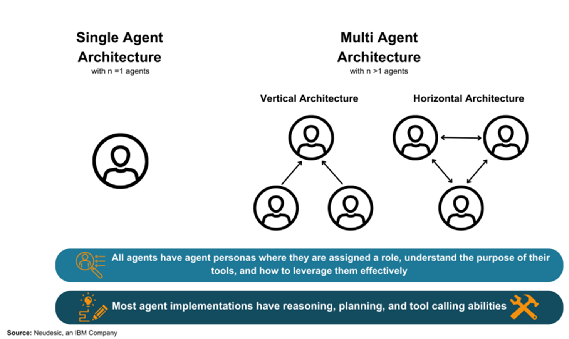

### Agents Concepts and Architectures

The development of a vertical multi-agent architecture for a personal banking assistant is inspired by a blend of cutting-edge research and practical applications in the field of generative AI and agent-based systems:

1. **Agent and Loop Mechanism**: An Agent is made up of three building blocks: Instructions (a.k.a prompt), Tools and LLM model to use. The core idea of agents is to use a language model like gpt4 to choose a sequence of actions, which can be supported by tools, in order to solve a task based on the instructions provided in the prompt. This can best be thought of as a loop where the agent iteratively processes user input, decides on actions or responses, and updates its internal state (agent scratchpad). This mechanism allows for complex interactions and task execution beyond simple text generation.

2. **Integration of AI Agents with LLMs and RAG**: AI agents enhance copilot application based on Retrieval Augmented Generation (RAG) pattern by enabling real-world task execution, decision-making, and real-time interaction. While in RAG a sequence of actions are well-known and are developed as a predefined LLM chain in app code, with agents a LLM is used as a reasoning engine to determine which actions to take and in which order.This integration is crucial for applications requiring dynamic responses and actions based on user inputs.

3. **Multi-Agent Architectures**: The debate between single and multi-agent systems highlights the versatility of multi-agent architectures in handling complex tasks requiring collaboration and multiple execution paths. Vertical and horizontal architectures represent two approaches, with most systems falling somewhere in between. Specifically, vertical architectures, where one agent acts as a leader coordinating with other specialized agents, are particularly relevant for building a personal banking assistant. This structure allows for a clear division of labor and efficient collaboration among agents with different functional domains.

5. **MicroAgents Concept**: The idea of MicroAgents, as proposed by the semantic kernel team at Microsoft, offers a practical approach for implementing vertical multi-agent systems. By partitioning agents by functional domain and associating each with a microservice, a banking assistant can leverage specialized knowledge and services (e.g., account management, transaction history, payments) to provide a comprehensive and user-friendly experience.
